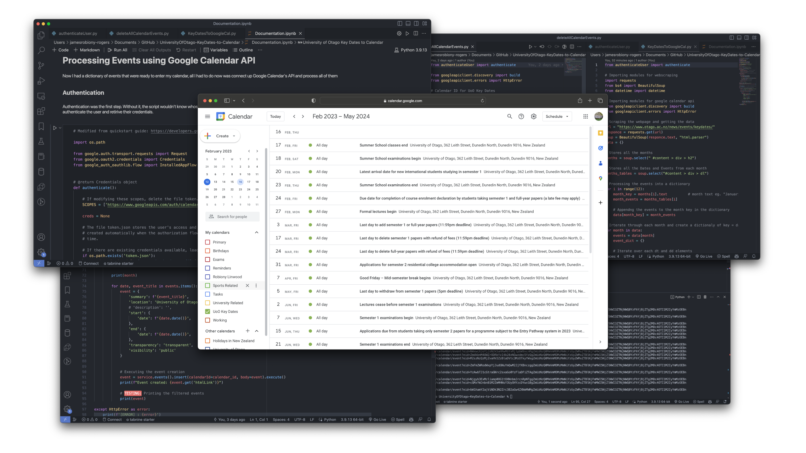

<!-- PROJECT SHIELDS -->
<!--
*** I'm using markdown "reference style" links for readability.
*** Reference links are enclosed in brackets [ ] instead of parentheses ( ).
*** See the bottom of this document for the declaration of the reference variables
*** for contributors-url, forks-url, etc. This is an optional, concise syntax you may use.
*** https://www.markdownguide.org/basic-syntax/#reference-style-links
-->
[![Contributors][contributors-shield]][contributors-url] [![Forks][forks-shield]][forks-url] [![Stargazers][stars-shield]][stars-url] [![Issues][issues-shield]][issues-url] [![MIT License][license-shield]][license-url]


<!-- PROJECT LOGO -->
<br />
<p align="center">
    <h1 align="center"> University of Otago Key Dates to Calendar </h1>
    <h6 align="center"> February 2023 </h6>

  <p align="center">
    Small project to learn a bit of web scraping, OAuth authentication and calling APIs in Python. 
  </p>
</p>

___


## Overview 

The problem I was having was that I didn't want to have to go through [Otago's key dates page](https://www.otago.ac.nz/news/events/keydates/) and manually add all the events I needed to keep track of. So I devised a Python script to do it for me. 


## Built With

* **Language:** [Python](https://www.python.org) 
* **Libraries:** [BeautifulSoup](https://www.crummy.com/software/BeautifulSoup/bs4/doc/)
* **API** [Google API Python Client](https://github.com/googleapis/google-api-python-client)


## File Tree 
- `KeyDatesToGoogleCal.py` - Main script to scrape the key dates page and add them to the user's Google Calendar
- `authenticateUser.py` - Small script to authenticate the user with Google Calendar API 
- `deleteAllCalendarEvents.py` - Small script to delete all events from the user's Google Calendar (useful for testing)
</br>

- `Documentation.ipynb` - A notebook to document the process of building the project   


## Running Locally

1. Clone the repo using Git
```sh
gh repo clone JamesRobionyRogers/UniversityOfOtago-KeyDates-to-Calendar
```

2. Install the required packages
```sh
pip install 
```

3. Change the `calendarId` variable in `KeyDatesToGoogleCal.py` to your Google Calendar ID. You can find this by going to your Google Calendar settings and copying the Calendar ID.

4. Run the script 
```sh
python KeyDatesToGoogleCal.py
```

5. Follow the prompts to authenticate the script with your Google account.

<!-- USAGE EXAMPLES -->
## View Project

<div align="center">
   
</div>


<!-- Use this space to show useful examples of how a project can be used. Additional screenshots, code examples and demos work well in this space. You may also link to more resources. -->

## Further Improvement

Here are a couple of improvements I would like to make to this project in the future

- [ ] Create improvements on the filter as there are still some irrelevant events being added to the calendar
  - Could be done through removing events that contain certain words from the already filtered events


<!-- MARKDOWN LINKS & IMAGES -->
<!-- https://www.markdownguide.org/basic-syntax/#reference-style-links -->
[contributors-shield]: https://img.shields.io/github/contributors/jamisbuggerlugs/Spaced-Repitition-Software-Website.svg?style=flat-square
[contributors-url]: https://github.com/JamisBuggerlugs/Spaced-Repitition-Software-Website/graphs/contributors
[forks-shield]: https://img.shields.io/github/forks/JamisBuggerlugs/Spaced-Repitition-Software-Website.svg?style=flat-square
[forks-url]: https://github.com/JamisBuggerlugs/Spaced-Repitition-Software-Website/network/members
[stars-shield]: https://img.shields.io/github/stars/JamisBuggerlugs/Spaced-Repitition-Software-Website.svg?style=flat-square
[stars-url]: https://github.com/JamisBuggerlugs/Spaced-Repitition-Software-Website/stargazers
[issues-shield]: https://img.shields.io/github/issues/JamisBuggerlugs/Spaced-Repitition-Software-Website.svg?style=flat-square
[issues-url]: https://github.com/JamisBuggerlugs/Spaced-Repitition-Software-Website/issues
[license-shield]: https://img.shields.io/github/license/JamisBuggerlugs/Spaced-Repitition-Software-Website.svg?style=flat-square
[license-url]: https://github.com/JamisBuggerlugs/Spaced-Repitition-Software-Website/blob/master/LICENSE.txt
[linkedin-shield]: https://img.shields.io/badge/-LinkedIn-black.svg?style=flat-square&logo=linkedin&colorB=555
[linkedin-url]: https://www.linkedin.com/in/james-robiony-rogers-447b28237/
[product-screenshot]: imgs/readme-assets/desktop-home-light.png
